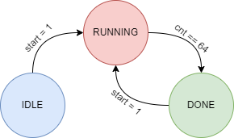

## Serial Parallel Multiplier

### Overview

The Serial Parallel Multiplier (SPM) is a digital circuit designed to perform high-speed multiplication operations by combining serial and parallel processing techniques. This Verilog project showcases the implementation of a Serial Parallel Multiplier using Carry Save Adder (CSA) modules, providing an efficient solution for multiplication tasks in digital signal processing, cryptography, and other applications requiring fast arithmetic operations.

Let us multiply a 4-bit binary. The result is as shown below,

 

The flow of data in each cycle is as shown below,

  

### Features

- **Parameterized Design**: The module is designed to be scalable with a parameterized size, making it adaptable for various bit-widths.
- **Carry Save Adder Integration**: Utilizes Carry Save Adder (CSA) modules to improve the speed and efficiency of the multiplication process.
- **Modular Architecture**: The project is organized into separate Verilog files for clarity and modularity, with a clear distinction between the spm and csa modules.
- **Synchronous Reset**: Includes synchronous reset functionality to ensure predictable initialization of the circuit.
### File Structure

- **src/**
	- `pm.v`: Verilog file containing the top module for Serial Parallel Multiplier (SPM) module.
    - `spm.v`: Verilog file containing the Serial Parallel Multiplier (SPM) module.
    - `csa.v`: Verilog file containing the Carry Save Adder (CSA) module.
- **tb/**
    - `pm_TB.v`: Testbench for verifying the functionality of the Serial Parallel Multiplier.
    - `pm_TB_V2.v`: Testbench for verifying the functionality of the Serial Parallel Multiplier with testcases from dataIn.mem.
    - `dataIn.mem`: Memory file containing the testcases as decimal.

### Finite State Machine (FSM) Overview

The `pm` module incorporates a Finite State Machine (FSM) to control the flow of operations for a parallel multiplier. The FSM ensures that the multiplication process is executed in a structured sequence, handling different stages of operation and synchronization.

  

### Result

The module is tested with test cases stored in `dataIn.mem`. The simulation output in the TCL console window is shown below:

    

The waveform window for a single test case is shown below. The start signal is asserted for one clock cycle to initiate the multiplication. After several cycles, the done signal goes high, indicating that the result is ready.

  

